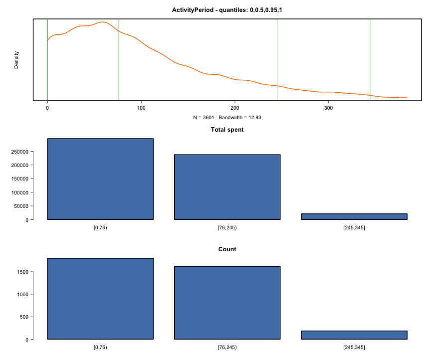
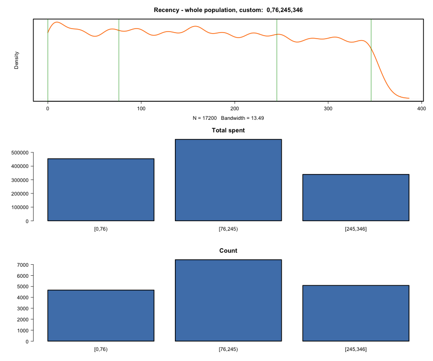
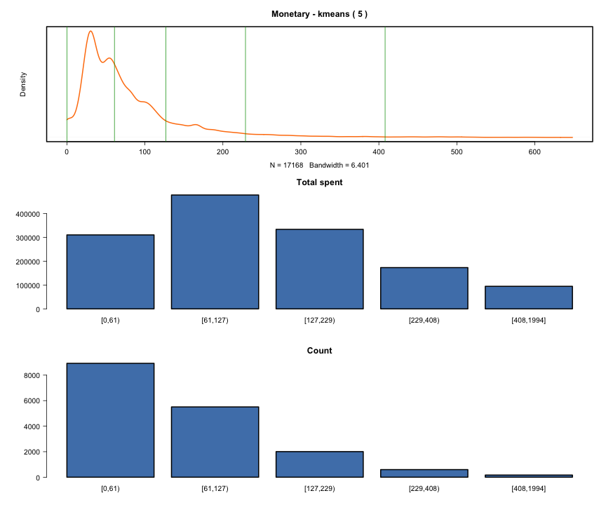
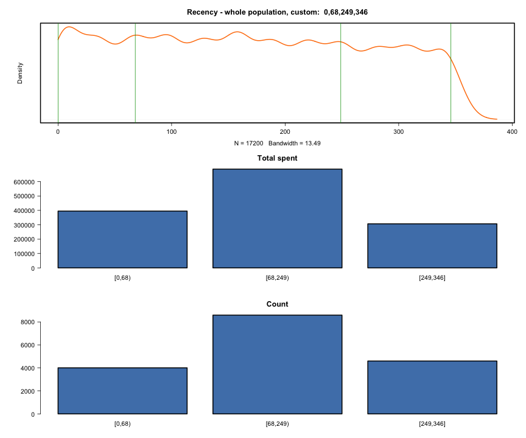
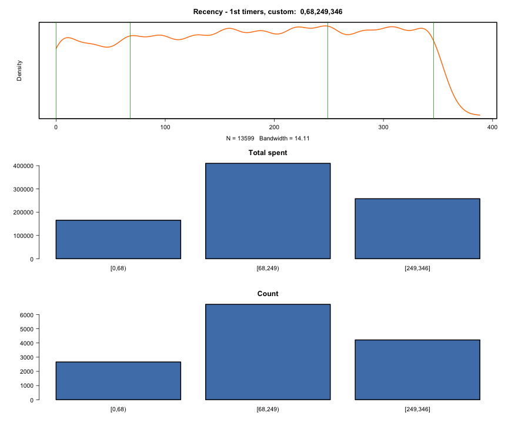
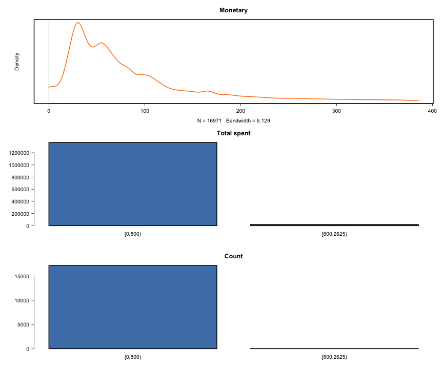

eRFM Automation
========================================================

### Sales Items data to analize
##### Files: Automation_Orders.csv
#### Affected years (parameter rfm_calc_years), minimum and  maximum purchase dates :

```
rfm_calc_years parameter: 2 ; Data from: 2020-01-01 ; to: 2020-12-12
```
#### Make sure the Monetary values are bigger or equal then zero, and there are no NULL or bad values in Order Date

```
## Count of negative Monetary values: 0
```

### Frequency
#### Frequency Table

| id|   F.1|  F.2| F.3| F.4| F.5| F.6| F.7| F.8| F.9| F.10| F.14| F.16| F.18| F.37|
|--:|-----:|----:|---:|---:|---:|---:|---:|---:|---:|----:|----:|----:|----:|----:|
|  1| 13599| 2443| 691| 261| 110|  47|  23|  13|   5|    3|    1|    1|    2|    1|
#### Frequency - 30


#### Frequency - first timers vs recurring

```
Mean: 1.33 
```

```
Interval limits:  
1 2 37 
```



```

Interval Totals. 
   group  total
1  [1,2) 833448
2 [2,37] 554929

Interval Counts. 
   group count
1  [1,2) 13599
2 [2,37]  3601
```

The recurring customers (20.94 % of whole population) are responsible for the 39.97% of Total Revenue. The first timers are (79.06 % of whole population) are responsible for the 60.03% of Total Revenue.

First timer customers average spent value: 61 
Recurring customers average spent value: 154 

### Conversion Period
#### Conversion Period - based on quantiles

```
Mean: 92.29 
```

```
Interval limits:  
0 68 249 345 
```



```

Interval Totals. 
      group  total
1    [0,68) 291655
2  [68,249) 240586
3 [249,345]  22688

Interval Counts. 
      group count
1    [0,68)  1795
2  [68,249)  1623
3 [249,345]   183
```

### Activity Period
#### Activity Period - based on quantiles

```
Mean: 92.54 
```

```
Interval limits:  
0 76 245 345 
```


```

Interval Totals. 
      group  total
1    [0,76) 296356
2  [76,245) 237582
3 [245,345]  20991

Interval Counts. 
      group count
1    [0,76)  1798
2  [76,245)  1618
3 [245,345]   185
```

### Recency
#### Recurring recency - kmeans

```
Error in array(x, c(length(x), 1L), if (!is.null(names(x))) list(names(x), : 'data' must be of a vector type, was 'NULL'
```

#### Recurring recency - by quantiles

```
Mean: 116.9 
```

```
Interval limits:  
0 100 286 346 
```


```

Interval Totals. 
      group  total
1   [0,100) 304918
2 [100,286) 227238
3 [286,346]  22773

Interval Counts. 
      group count
1   [0,100)  1799
2 [100,286)  1621
3 [286,346]   181
```

#### Whole population recency - by custom

```
Mean: 165.67 
```

```
Interval limits:  
0 68 249 346 
```



```

Interval Totals. 
      group  total
1    [0,68) 395005
2  [68,249) 686954
3 [249,346] 306418

Interval Counts. 
      group count
1    [0,68)  4008
2  [68,249)  8592
3 [249,346]  4600
```

#### 1st timers recency - by custom

```
Mean: 178.58 
```

```
Interval limits:  
0 68 249 346 
```



```

Interval Totals. 
      group  total
1    [0,68) 165439
2  [68,249) 410071
3 [249,346] 257938

Interval Counts. 
      group count
1    [0,68)  2660
2  [68,249)  6724
3 [249,346]  4215
```

#### Group counts based on custom recency intervals

##### 1st Timers

```

   [0,68]  (68,249] (249,346] 
     2702      6778      4119 
```
##### Recurring

```

   [0,68]  (68,249] (249,346] 
     1376      1853       372 
```

### Monetary
#### Monetary - kmeans

```
[1] "Top 10 excluded customer by monetary:"
         CustomerID Monetary
61     11ELECOM1035     1256
2246  11ELECOM15504     1994
5877    11ELECOM241      988
6964  11ELECOM26637     1167
8733  11ELECOM31572     1121
10842  11ELECOM3724     1029
12935  11ELECOM4388     1066
14352   11ELECOM482     1212
14866 11ELECOM50091     1273
16176  11ELECOM6877      943
```

```
breaks: 
0 61 127 230 408 1994 
Mean: 80.72 
```

```
Interval limits:  
0 61 127 230 408 1994 
```


```

Interval Totals. 
       group  total
1     [0,61) 310043
2   [61,127) 477385
3  [127,230) 335171
4  [230,408) 171203
5 [408,1994]  94575

Interval Counts. 
       group count
1     [0,61)  8924
2   [61,127)  5508
3  [127,230)  2013
4  [230,408)   587
5 [408,1994]   168
```

```
[1]    0   61  127  230  408 1994
```

#### Monetary - by custom

```
[1] 1994
```

```
Mean: 80.72 
```

```
Interval limits:  
0 800 2625 10120 40765 42394 
```



```

Interval Totals. 
       group   total
1    [0,800) 1369107
2 [800,2625)   19270

Interval Counts. 
       group count
1    [0,800) 17182
2 [800,2625)    18
```
#### Registration date and First order distance density

