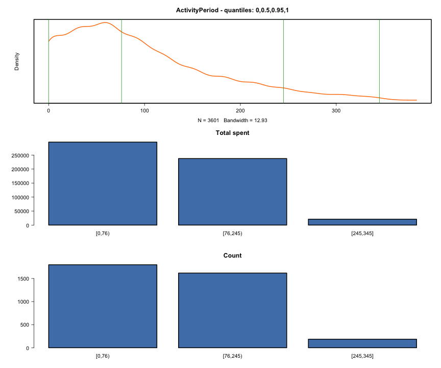

eRFM Automation
========================================================

### Sales Items data to analize
##### Files: Automation_Orders.csv
#### Affected years (parameter rfm_calc_years), minimum and  maximum purchase dates :

```
rfm_calc_years parameter: 2 ; Data from: 2020-01-01 ; to: 2020-12-12
```
#### Make sure the Monetary values are bigger or equal then zero, and there are no NULL or bad values in Order Date

```
## Count of negative Monetary values: 0
```

### Frequency
#### Frequency - first timers vs recurring

```
Mean: 1.33 
```

```
Interval limits:  
1 2 37 
```


```

Interval Totals. 
   group  total
1  [1,2) 833448
2 [2,37] 554929

Interval Counts. 
   group count
1  [1,2) 13599
2 [2,37]  3601
```

The recurring customers (20.94 % of whole population) are responsible for the 39.97% of Total Revenue. The first timers are (79.06 % of whole population) are responsible for the 60.03% of Total Revenue.

First timer customers average spent value: 61 
Recurring customers average spent value: 154 

### Activity Period
#### Activity Period - based on quantiles

```
Count of recurring customers: 3601
```

```
Mean: 92.54 
```

```
Interval limits:  
0 76 245 345 
```



```

Interval Totals. 
      group  total
1    [0,76) 296356
2  [76,245) 237582
3 [245,345]  20991

Interval Counts. 
      group count
1    [0,76)  1798
2  [76,245)  1618
3 [245,345]   185
```

### Recency
#### Whole population recency - by custom

```
Mean: 165.67 
```

```
Interval limits:  
0 76 245 346 
```


```

Interval Totals. 
      group  total
1    [0,76) 453975
2  [76,245) 595296
3 [245,346] 339106

Interval Counts. 
      group count
1    [0,76)  4667
2  [76,245)  7442
3 [245,346]  5091
```

### Monetary
#### Monetary - kmeans

```
Top 10 excluded
```

```
breaks: 
0 61 127 229 408 1994 
Mean: 80.72 
```

```
Interval limits:  
0 61 127 229 408 1994 
```


```

Interval Totals. 
       group  total
1     [0,61) 310043
2   [61,127) 477385
3  [127,229) 333339
4  [229,408) 173035
5 [408,1994]  94575

Interval Counts. 
       group count
1     [0,61)  8924
2   [61,127)  5508
3  [127,229)  2005
4  [229,408)   595
5 [408,1994]   168
```

```
[1]    0   61  127  229  408 1994
```


#### Monetary - by custom

